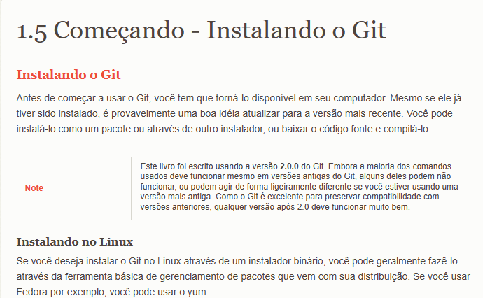
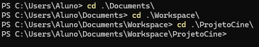

# MANUAL DE UTILIZAÇÃO DO SISTEMA/SITE
## CAPITULO 0 - INSTALAÇÃO DO GIT NO COMPUTADOR
### verificar se o Git Esta Instalado

```
git --version // Verificar se o GIT esta instalado
```

### Instalação o Git

<p align="justify">
    Instalar GIT(https://git-scm.com/book/pt-br/v2/Come%C3%A7ando-Instalando-o-Git)
</p>

<p align="center">
    <a href="https://git-scm.com/book/pt-br/v2/Come%C3%A7ando-Instalando-o-Git" target="_blank">
        
    </a>
</p>

## CAPITULO 1 - CRIAÇÃO DE DIRETORIOS DE PASTAS

<p align="justify">
    Entre na pasta Documentos e crie uma pasta chamada Workspace.
    Dentro da pasta Workspace crie uma pasta para por todos os seus projetos.
</p>

### Comandos passo a passo desse capitulo

```
NO TERMINAL

cd Documents - Serve para entrar na pasta Documentos

mkdir Workspace - Criar Pasta

cd Workspace - Serve para entrar na pasta Workspace
```
<p align="center">
    <a>
    
    </a>
</p>

## CAPITULO 2 - ENTRANDO NO GITHUB

<p align="justify">
    No navegador, entre na sua conta do GitHub ou, se não tiver, crie uma.
    Crie um repositorio ou, se já tiver um, clone o seu projeto.
    No repositório, vá na opção < > Code e copie o link HTTPS.
</p>

<p align="center">
    <a>
    
    </a>
</p>

### Comandos passo a passo desse capitulo

```
NO TERMINAL

git clone link do projeto - Serve para trazer seu projeto do GitHub.
```

## CAPITULO 3 - CONFIGURANDO SUA CONTA

<p align="justify">
    Volte para o diretorio original, usando o comando cd .. .
    Configure sua conta usando os seguintes comandos abaixo.
    ```
    git config --global user.name "Seu Nome de Usuário"
    git config --global user.email Seu email do GitHub
    ```
    Se não acontecer nada, significa que deu tudo certo
</p>

<p align="center">
    <a>
    
    </a>
</p>

### Comandos passo a passo desse capitulo

```
NO TERMINAL

cd .. Serve para voltar um diretório
git config --global user.name "Seu Nome de Usuário" - Conecta o seu nome de usuário do GitHub.
git config --global user.email Seu email do GitHub - Conecta o seu email do GitHub.
```

## CAPITULO 4 - CRIANDO A CHAVE E COLOCANDO NO GITHUB

<p align="justify">
    Após configurar sua conta no terminal, crie sua chave SSH com o comando ssh-keygen.
    Logo em seguida, ira pedir uma senha, crie uma e depois repita a senha criada.
</p>

<p align="center">
    <a>
    
    </a>
</p>

<p align="justify">
    Com a chave SSH criada, navegue até a pasta ssh utilizando o comando cd .ssh .
    Utilize o comando ls para verificar se a chave esta na pasta ssh.
    Use o comando cat .\id_ed25519.pub para ler a chave.
</p>

<p align="center">
    <a>
    
    </a>
</p>

<p align="justify">
    Copie a chave SSH e entre na sua conta do GitHub, clique no icone do seu perfil e vá para settings.
</p>