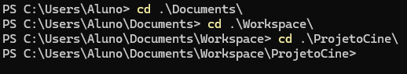

# MANUAL DE UTILIZAÇÃO DO SISTEMA/SITE
## CAPITULO 1 - Configuração do git no computador
### Instalação do GIT 

<p align="justify">
    Instalar GIT(https://git-scm.com/book/pt-br/v2/Come%C3%A7ando-Instalando-o-Git)
</p>

<p align="center">
    <a href="https://git-scm.com/book/pt-br/v2/Come%C3%A7ando-Instalando-o-Git" target="_blank">
        
    </a>
</p>

```
git --version // Verificar se o GIT esta instalado
```

### Diretório de Pastas

<p align="center">
    <a>
    
    </a>
</p>

### Comandos administrativos do GIT

```
git status

git add index.html or git add .

git commit -m "Mensagem do desenvolvedor" ex: "Update file README"

git push -u origin master or main
```

## CAPITULO 2 -  Criando repositorio no git
### Criando a chave ssh

```
git config --global user.name "Nome de Usuario"

git config --global user.email "email@usuario.com"

ssh-keygen
```

### Criando o Repositorio

```
git init

git remote add origin https://github.com/SEU-USUARIO/nome-do-repositorio.git

git branch -M main

git push -u origin main
```